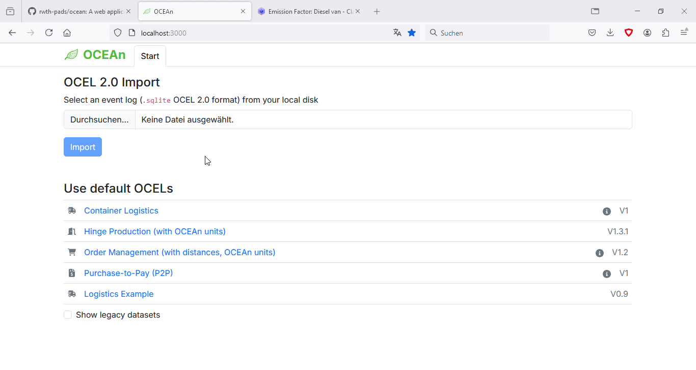

# OCEAn

[](https://www.python.org/downloads/release/python-3100/)
[](https://fastapi.tiangolo.com/)
[]()
[![PM4Py](https://img.shields.io/badge/PM4Py-white.svg?logo=data:image/svg%2bxml;base64,PD94bWwgdmVyc2lvbj0iMS4wIiBlbmNvZGluZz0iVVRGLTgiIHN0YW5kYWxvbmU9Im5vIj8+CjxzdmcKICAgeG1sbnM6ZGM9Imh0dHA6Ly9wdXJsLm9yZy9kYy9lbGVtZW50cy8xLjEvIgogICB4bWxuczpjYz0iaHR0cDovL2NyZWF0aXZlY29tbW9ucy5vcmcvbnMjIgogICB4bWxuczpyZGY9Imh0dHA6Ly93d3cudzMub3JnLzE5OTkvMDIvMjItcmRmLXN5bnRheC1ucyMiCiAgIHhtbG5zOnN2Zz0iaHR0cDovL3d3dy53My5vcmcvMjAwMC9zdmciCiAgIHhtbG5zPSJodHRwOi8vd3d3LnczLm9yZy8yMDAwL3N2ZyIKICAgeG1sbnM6eGxpbms9Imh0dHA6Ly93d3cudzMub3JnLzE5OTkveGxpbmsiCiAgIHhtbG5zOnNvZGlwb2RpPSJodHRwOi8vc29kaXBvZGkuc291cmNlZm9yZ2UubmV0L0RURC9zb2RpcG9kaS0wLmR0ZCIKICAgeG1sbnM6aW5rc2NhcGU9Imh0dHA6Ly93d3cuaW5rc2NhcGUub3JnL25hbWVzcGFjZXMvaW5rc2NhcGUiCiAgIHZlcnNpb249IjEuMSIKICAgd2lkdGg9IjI5OTcuMTI0NSIKICAgaGVpZ2h0PSIyOTk3LjEyNDUiCiAgIGlkPSJzdmcxOCIKICAgc29kaXBvZGk6ZG9jbmFtZT0icG00cHktc2l0ZS1sb2dvLnN2ZyIKICAgaW5rc2NhcGU6dmVyc2lvbj0iMC45Mi40ICg1ZGE2ODljMzEzLCAyMDE5LTAxLTE0KSI+CiAgPG1ldGFkYXRhCiAgICAgaWQ9Im1ldGFkYXRhMjQiPgogICAgPHJkZjpSREY+CiAgICAgIDxjYzpXb3JrCiAgICAgICAgIHJkZjphYm91dD0iIj4KICAgICAgICA8ZGM6Zm9ybWF0PmltYWdlL3N2Zyt4bWw8L2RjOmZvcm1hdD4KICAgICAgICA8ZGM6dHlwZQogICAgICAgICAgIHJkZjpyZXNvdXJjZT0iaHR0cDovL3B1cmwub3JnL2RjL2RjbWl0eXBlL1N0aWxsSW1hZ2UiIC8+CiAgICAgICAgPGRjOnRpdGxlPjwvZGM6dGl0bGU+CiAgICAgIDwvY2M6V29yaz4KICAgIDwvcmRmOlJERj4KICA8L21ldGFkYXRhPgogIDxkZWZzCiAgICAgaWQ9ImRlZnMyMiI+CiAgICA8bGluZWFyR3JhZGllbnQKICAgICAgIGlua3NjYXBlOmNvbGxlY3Q9ImFsd2F5cyIKICAgICAgIHhsaW5rOmhyZWY9IiNTdmdqc0xpbmVhckdyYWRpZW50MjczNCIKICAgICAgIGlkPSJsaW5lYXJHcmFkaWVudDgzOCIKICAgICAgIGdyYWRpZW50VHJhbnNmb3JtPSJzY2FsZSgyLjE3MzQ3NDUsMC40NjAwOTI4MikiCiAgICAgICB4MT0iMC43NDUzNTAzNiIKICAgICAgIHkxPSIxMC44NjczNzIiCiAgICAgICB4Mj0iMzMuMjYwNTI5IgogICAgICAgeTI9IjEwLjg2NzM3MiIKICAgICAgIGdyYWRpZW50VW5pdHM9InVzZXJTcGFjZU9uVXNlIiAvPgogICAgPGxpbmVhckdyYWRpZW50CiAgICAgICBpbmtzY2FwZTpjb2xsZWN0PSJhbHdheXMiCiAgICAgICB4bGluazpocmVmPSIjU3ZnanNMaW5lYXJHcmFkaWVudDI3MzQiCiAgICAgICBpZD0ibGluZWFyR3JhZGllbnQ4NDAiCiAgICAgICBncmFkaWVudFRyYW5zZm9ybT0ic2NhbGUoMi4xNzM0NzQ1LDAuNDYwMDkyODIpIgogICAgICAgeDE9IjAuNzQ1MzUwMzYiCiAgICAgICB5MT0iMTAuODY3MzcyIgogICAgICAgeDI9IjMzLjI2MDUyOSIKICAgICAgIHkyPSIxMC44NjczNzIiCiAgICAgICBncmFkaWVudFVuaXRzPSJ1c2VyU3BhY2VPblVzZSIgLz4KICA8L2RlZnM+CiAgPHNvZGlwb2RpOm5hbWVkdmlldwogICAgIHBhZ2Vjb2xvcj0iI2ZmZmZmZiIKICAgICBib3JkZXJjb2xvcj0iIzY2NjY2NiIKICAgICBib3JkZXJvcGFjaXR5PSIxIgogICAgIG9iamVjdHRvbGVyYW5jZT0iMTAiCiAgICAgZ3JpZHRvbGVyYW5jZT0iMTAiCiAgICAgZ3VpZGV0b2xlcmFuY2U9IjEwIgogICAgIGlua3NjYXBlOnBhZ2VvcGFjaXR5PSIwIgogICAgIGlua3NjYXBlOnBhZ2VzaGFkb3c9IjIiCiAgICAgaW5rc2NhcGU6d2luZG93LXdpZHRoPSIxOTIwIgogICAgIGlua3NjYXBlOndpbmRvdy1oZWlnaHQ9IjExMzciCiAgICAgaWQ9Im5hbWVkdmlldzIwIgogICAgIHNob3dncmlkPSJmYWxzZSIKICAgICBmaXQtbWFyZ2luLWJvdHRvbT0iMCIKICAgICBmaXQtbWFyZ2luLXRvcD0iMCIKICAgICBmaXQtbWFyZ2luLWxlZnQ9IjAiCiAgICAgZml0LW1hcmdpbi1yaWdodD0iMCIKICAgICBpbmtzY2FwZTp6b29tPSIwLjIxMjEyMTIxIgogICAgIGlua3NjYXBlOmN4PSIyMDIyLjI3NDEiCiAgICAgaW5rc2NhcGU6Y3k9IjEwOTAuNjUzIgogICAgIGlua3NjYXBlOndpbmRvdy14PSItOCIKICAgICBpbmtzY2FwZTp3aW5kb3cteT0iLTgiCiAgICAgaW5rc2NhcGU6d2luZG93LW1heGltaXplZD0iMSIKICAgICBpbmtzY2FwZTpjdXJyZW50LWxheWVyPSJnMTYiIC8+CiAgPGcKICAgICB0cmFuc2Zvcm09Im1hdHJpeCgxNSwwLDAsMTUsMC4wNDYzODc0MSwyMjEyLjY3NykiCiAgICAgaWQ9ImcxNiI+CiAgICA8ZGVmcwogICAgICAgaWQ9IlN2Z2pzRGVmczI3MzAiPgogICAgICA8bGluZWFyR3JhZGllbnQKICAgICAgICAgaWQ9IlN2Z2pzTGluZWFyR3JhZGllbnQyNzM0Ij4KICAgICAgICA8c3RvcAogICAgICAgICAgIGlkPSJTdmdqc1N0b3AyNzM1IgogICAgICAgICAgIHN0b3AtY29sb3I9IiMyZDM4OGEiCiAgICAgICAgICAgb2Zmc2V0PSIwIiAvPgogICAgICAgIDxzdG9wCiAgICAgICAgICAgaWQ9IlN2Z2pzU3RvcDI3MzYiCiAgICAgICAgICAgc3RvcC1jb2xvcj0iIzAwYWVlZiIKICAgICAgICAgICBvZmZzZXQ9IjEiIC8+CiAgICAgIDwvbGluZWFyR3JhZGllbnQ+CiAgICAgIDxsaW5lYXJHcmFkaWVudAogICAgICAgICBpZD0iU3ZnanNMaW5lYXJHcmFkaWVudDI3MzciPgogICAgICAgIDxzdG9wCiAgICAgICAgICAgaWQ9IlN2Z2pzU3RvcDI3MzgiCiAgICAgICAgICAgc3RvcC1jb2xvcj0iIzJkMzg4YSIKICAgICAgICAgICBvZmZzZXQ9IjAiIC8+CiAgICAgICAgPHN0b3AKICAgICAgICAgICBpZD0iU3ZnanNTdG9wMjczOSIKICAgICAgICAgICBzdG9wLWNvbG9yPSIjMDBhZWVmIgogICAgICAgICAgIG9mZnNldD0iMSIgLz4KICAgICAgPC9saW5lYXJHcmFkaWVudD4KICAgIDwvZGVmcz4KICAgIDxnCiAgICAgICBpZD0iU3ZnanNHMjczMiIKICAgICAgIGZlYXR1cmVLZXk9InRleHQxIgogICAgICAgdHJhbnNmb3JtPSJtYXRyaXgoMi44MjczMDYzLDAsMCwyLjgyNzMwNjMsLTQuNTgzMzI4NywtODIuODkyNDMyKSIKICAgICAgIHN0eWxlPSJmaWxsOnVybCgjbGluZWFyR3JhZGllbnQ4NDApIj4KICAgICAgPHBhdGgKICAgICAgICAgZD0ibSA4LjM2LDUgcSAyLjM4LDAgMy44NCwxLjM3IDEuNDYsMS4zNyAxLjQ2LDMuNjUgMCwyLjI4IC0xLjQ0LDMuNjQgLTEuNDQsMS4zNiAtMy44NiwxLjM2IEggNC41NCB2IDQuMDggcSAwLDAuMjggLTAuMjEsMC40OSBRIDQuMTIsMTkuOCAzLjg0LDE5LjggSCAyLjMyIFEgMi4wNCwxOS44IDEuODMsMTkuNTkgMS42MiwxOS4zOCAxLjYyLDE5LjEgdiAtNi4yIHEgMCwtMC4yOCAwLjIxLC0wLjQ5IDAuMjEsLTAuMjEgMC40OSwtMC4yMSBoIDUuOTIgcSAxLjM0LDAgMS45MiwtMC41OCAwLjU4LC0wLjUyIDAuNTgsLTEuNTggMCwtMS4wNiAtMC42LC0xLjYzIFEgOS41NCw3Ljg0IDguMjQsNy44NCBIIDIuMzIgUSAyLjA0LDcuODQgMS44Myw3LjYzIDEuNjIsNy40MiAxLjYyLDcuMTQgViA1LjcgUSAxLjYyLDUuNDIgMS44Myw1LjIxIDIuMDQsNSAyLjMyLDUgWiBtIDIxLjA4LDAgcSAwLjI4LDAgMC40OSwwLjIxIDAuMjEsMC4yMSAwLjIxLDAuNDkgdiAxMy40IHEgMCwwLjI4IC0wLjIxLDAuNDkgLTAuMjEsMC4yMSAtMC40OSwwLjIxIGggLTEuNTIgcSAtMC4zLDAgLTAuNSwtMC4yMSAtMC4yLC0wLjIxIC0wLjIsLTAuNDkgdiAtOS4wNCBsIC0zLjcsNC43NiBxIC0wLjIyLDAuMjYgLTAuNTYsMC4yNiB2IDAgcSAtMC4xNiwwIC0wLjMyLC0wLjA3IFEgMjIuNDgsMTQuOTQgMjIuNCwxNC44IEwgMTUuODQsNi4xMiBRIDE1LjcyLDUuOTggMTUuNyw1Ljc3IDE1LjY4LDUuNTYgMTUuNzgsNS4zOSAxNS44OCw1LjIyIDE2LjA0LDUuMTEgMTYuMiw1IDE2LjQsNSBoIDEuNzYgcSAwLjM0LDAgMC41NiwwLjI4IGwgNC4yNCw1LjYgNC4xNCwtNS42IFEgMjcuMzIsNSAyNy42OCw1IFogbSAtMTEuNTIsOS43IHEgMC4yOCwwIDAuNDksMC4yIDAuMjEsMC4yIDAuMjEsMC41IHYgMy43IHEgMCwwLjI4IC0wLjIxLDAuNDkgLTAuMjEsMC4yMSAtMC40OSwwLjIxIEggMTYuNCBxIC0wLjI4LDAgLTAuNDksLTAuMjEgUSAxNS43LDE5LjM4IDE1LjcsMTkuMSB2IC0zLjcgcSAwLC0wLjMgMC4yMSwtMC41IDAuMjEsLTAuMiAwLjQ5LC0wLjIgeiBtIDI0LjUsLTEuMTQgcSAwLjMsMCAwLjUsMC4yIDAuMiwwLjIgMC4yLDAuNDggdiAxLjM2IHEgMCwwLjI4IC0wLjIsMC40OCAtMC4yLDAuMiAtMC41LDAuMiBoIC0wLjggdiAyLjcgcSAwLDAuMjggLTAuMjEsMC40OSAtMC4yMSwwLjIxIC0wLjQ5LDAuMjEgaCAtMS41IHEgLTAuMjgsMCAtMC40OSwtMC4yMSAtMC4yMSwtMC4yMSAtMC4yMSwtMC40OSB2IC0yLjcgaCAtNS42NCBxIC0wLjI4LDAgLTAuNDksLTAuMiAtMC4yMSwtMC4yIC0wLjIxLC0wLjQ4IHYgLTEuNDggcSAwLC0wLjIgMC4xMiwtMC4zOCBMIDM4LjA4LDUuMzIgUSAzOC4xNiw1LjE4IDM4LjMyLDUuMDkgMzguNDgsNSAzOC42Niw1IGggMi4yNiBxIDAuMjgsMCAwLjQ5LDAuMjEgMC4yMSwwLjIxIDAuMjEsMC40OSB2IDcuODYgeiBtIC02LjYyLDAgaCAyLjkyIFYgOS4yNCBaIE0gNTIuMjYsNSBxIDIuMzgsMCAzLjg0LDEuMzcgMS40NiwxLjM3IDEuNDYsMy42NSAwLDIuMjggLTEuNDQsMy42NCAtMS40NCwxLjM2IC0zLjg2LDEuMzYgaCAtMy44MiB2IDQuMDggcSAwLDAuMjggLTAuMjEsMC40OSAtMC4yMSwwLjIxIC0wLjQ5LDAuMjEgaCAtMS41MiBxIC0wLjI4LDAgLTAuNDksLTAuMjEgLTAuMjEsLTAuMjEgLTAuMjEsLTAuNDkgdiAtNi4yIHEgMCwtMC4yOCAwLjIxLC0wLjQ5IDAuMjEsLTAuMjEgMC40OSwtMC4yMSBoIDUuOTIgcSAxLjM0LDAgMS45MiwtMC41OCAwLjU4LC0wLjUyIDAuNTgsLTEuNTggMCwtMS4wNiAtMC42LC0xLjYzIC0wLjYsLTAuNTcgLTEuOSwtMC41NyBIIDQ2LjIyIFEgNDUuOTQsNy44NCA0NS43Myw3LjYzIDQ1LjUyLDcuNDIgNDUuNTIsNy4xNCBWIDUuNyBxIDAsLTAuMjggMC4yMSwtMC40OSBRIDQ1Ljk0LDUgNDYuMjIsNSBaIE0gNzIuMiw1LjM4IHEgMC4xLDAuMTggMC4wOSwwLjM4IC0wLjAxLDAuMiAtMC4xMywwLjM2IGwgLTUuNTQsOCB2IDUuMTQgcSAwLDAuMjggLTAuMjEsMC40OSAtMC4yMSwwLjIxIC0wLjQ5LDAuMjEgaCAtMS41NCBxIC0wLjMsMCAtMC41MSwtMC4yMSAtMC4yMSwtMC4yMSAtMC4yMSwtMC40OSBWIDEzLjQgcSAwLC0wLjIgMC4xNCwtMC40IEwgNjkuMTQsNS4zIFEgNjkuMjQsNS4xNiA2OS4zOSw1LjA4IDY5LjU0LDUgNjkuNzIsNSBoIDEuODYgcSAwLjIsMCAwLjM3LDAuMSAwLjE3LDAuMSAwLjI1LDAuMjggeiBtIC04LjQyLDQuNCBxIC0wLjA4LDAuMTggLTAuMjUsMC4yOCAtMC4xNywwLjEgLTAuMzcsMC4xIEggNjEuMyBxIC0wLjM2LDAgLTAuNiwtMC4zIEwgNTguMSw2LjEyIFEgNTgsNS45NiA1Ny45OSw1Ljc2IDU3Ljk4LDUuNTYgNTguMDYsNS4zOCA1OC4xNCw1LjIgNTguMzEsNS4xIDU4LjQ4LDUgNTguNjgsNSBoIDEuODggcSAwLjM0LDAgMC41OCwwLjMgbCAyLjYsMy43NCBxIDAuMSwwLjE2IDAuMTEsMC4zNiAwLjAxLDAuMiAtMC4wNywwLjM4IHoiCiAgICAgICAgIGlkPSJwYXRoMTAiCiAgICAgICAgIGlua3NjYXBlOmNvbm5lY3Rvci1jdXJ2YXR1cmU9IjAiCiAgICAgICAgIHN0eWxlPSJmaWxsOnVybCgjbGluZWFyR3JhZGllbnQ4MzgpIiAvPgogICAgPC9nPgogIDwvZz4KPC9zdmc+Cg==)](https://processintelligence.solutions/pm4py)
[](https://www.openapis.org/)
[](https://github.com/psf/black)

[](https://nodejs.org/en)
[](https://www.typescriptlang.org/)
[](https://react.dev/)
[](https://nextjs.org/)
[![React Bootstrap](https://img.shields.io/badge/React%20Bootstrap-712cf9?logo=data:image/svg%2bxml;base64,PHN2ZyBpZD0iTGF5ZXJfMSIgZGF0YS1uYW1lPSJMYXllciAxIiB4bWxucz0iaHR0cDovL3d3dy53My5vcmcvMjAwMC9zdmciIHZpZXdCb3g9IjAgMCAyMTI3Ljk4IDIwMTYuODciPjxkZWZzPjxzdHlsZT4uY2xzLTF7ZmlsbDojNDFlMGZkfTwvc3R5bGU+PC9kZWZzPjxwYXRoIGNsYXNzPSJjbHMtMSIgZD0iTTg4OCAxMTE5LjE3YzE2LTMyLjYyIDMyLjg0LTY1LjM3IDUwLjE3LTk3LjM1bC4xNS0uMjcgMTguMzktMzUuNjggMjcuMTYtNDUgLjE3LS4yOWMxMC4xNC0xNy4yNiAyMC42Ni0zNC42OCAzMS4yNy01MS43OGwxOC42OS0zMC44N2MyNC44OC00MS4xOSA0NC44OC03MS4yMyA3Ni40My0xMTQuNzYgMTctMjMuNDMgMzMuMTItNDQgNTguNjYtNzUuOTJsLjA2LS4wNiAxLjI2LTEuNTkuNDktLjYzYzEwLjM3LTEzLjIyIDIwLjg0LTI2LjI1IDMxLjExLTM4LjczbC4zNC0uNDIuMi0uMjVjMjMuODMtMjkuNTEgNDguMTItNTkuMTMgNzIuMTktODhsOS41Ny0xMS40OFYzNTYuNTRIMTI2N2MtOS4yMy04LjY4LTE4LjY2LTE3LjMtMjguMDgtMjUuNjktNzYuMzItNjcuNzItMTUyLjQzLTEyMC44NS0yMjYuMjctMTU3Ljc5LTc1LjcxLTM3LjkyLTE0NS42My01Ny4xNC0yMDcuOC01Ny4xNC00NC4zOSAwLTg0LjA2IDkuOTQtMTE3LjkxIDI5LjUzLTMyLjU1IDE4Ljg0LTU5LjkgNDYuOTEtODEuMzEgODMuNDQtMjAuMDYgMzQuMjMtMzQuODQgNzUuODktNDMuOTUgMTIzLjgxLTE3LjU0IDkyLjM3LTEzLjc0IDIwOCAxMSAzMzQuMzQgMy4xMiAxNS45IDYuNTYgMzIgMTAuMjUgNDgtMTkuNzQgNi0zOC45MSAxMi4xOC01Ny4xMyAxOC41My0xMTkuMjYgNDEuNTgtMjE5IDk1LjkxLTI4OC40MiAxNTcuMTQtMzYgMzEuNzEtNjMuODQgNjUuMjMtODIuODkgOTkuNjItMjAuMjQgMzYuNTctMzAuNTEgNzQuMDgtMzAuNTEgMTExLjQ5IDAgNzUgNDEuNTUgMTUxIDEyMC4xNSAyMTkuOTQgNzQgNjQuOTMgMTc4LjY1IDEyMS42MiAzMDIuNTUgMTY0IDExLjUxIDMuOTEgMjMuMjIgNy43MSAzNSAxMS4zNC00LjEyIDE3LjkzLTcuOTMgMzYtMTEuMzYgNTQtMjMuNTYgMTI0LjA4LTI2LjMxIDIzNy42Mi04IDMyOC4zNSA5LjUxIDQ3IDI0LjYxIDg3Ljg5IDQ0Ljg5IDEyMS41NyAyMS41NiAzNS44IDQ4LjkzIDYzLjQ0IDgxLjM0IDgyLjEzIDM0LjE1IDE5LjY5IDc0LjM0IDI5LjY3IDExOS40NSAyOS42NyA2MS40MiAwIDEzMC4wOS0xOC4yMSAyMDQuMTEtNTQuMTMgNzIuNTYtMzUuMjEgMTQ2LjYzLTg1LjY0IDIyMC4xMy0xNDkuODkgMTEuMzMtOS45IDIzLTIwLjQ5IDM0LjY2LTMxLjUzaDE3LjQxdi0xNzQuMzlsLTYuMzQtNy44LTMtMy42Ny03OS44Mi05OC41NS00NC4zNS01NC43NWMtMjIuMzktMjcuNjQtNTguMjUtNzguNzktMTAxLTE0NC0zNC01MS44NC01OC43Ni05My40Ny03MC41LTExMy42M2wtMS4yOC0yLjIxYy0yMC40OS0zNS4zMy0zNS43MS02My43OS00Ny45My04Ni42NC0xNS4zLTI4LjYzLTMwLjM5LTU3Ljg3LTQ0LjkxLTg3bDIuNjYtNS4xN3ptLTgwLjg2LTE3Mi44OWMtMTMuNTMtMzQuNy0yNS45Mi02OS4xMy0zNy0xMDIuODEgMzQuNTctNy4xMyA3MC41MS0xMy41MyAxMDcuMzItMTkuMTEtMTIuMjggMjAuMTEtMjQuMzQgNDAuNDEtMzYgNjAuNjRzLTIzLjEyIDQwLjY5LTM0LjMyIDYxLjI4em0tMzguMjUgNDYyLjFjMTEuNDUtMzQuODYgMjQuMzEtNzAuNTYgMzguMzktMTA2LjU5IDExLjI5IDIwLjcgMjIuODcgNDEuMyAzNC41OCA2MS41MyAxMi4yNyAyMS4xOSAyNSA0Mi40OCAzNy45NSA2My41OC0zOC40Ni01LjMyLTc1LjYyLTExLjUzLTExMC45Mi0xOC41MXpNNzA3LjE4IDM5Ny4xNmM5LTYxLjc0IDI5LjE0LTEwNS44NyA1NS4zNy0xMjEuMDYgMTAuODktNi4zMSAyNS4zNC05LjUgNDIuOTMtOS41IDM4LjQ3IDAgODguMjQgMTUuMSAxNDMuOTEgNDMuNjcgNjAuMzQgMzEgMTI1Ljc3IDc3LjExIDE4OS4yMiAxMzMuNDVxNS45IDUuMjQgMTIuMDcgMTAuODljLTU1LjgxIDYxLjcxLTExMC44MSAxMzAuMjgtMTYzLjY4IDIwNC4xLTkwLjA4IDguOC0xNzYuNjggMjEuOTQtMjU3Ljc2IDM5LjExLTIuOTMtMTIuODQtNS42OC0yNS43NS04LjItMzguNWwtLjI0LTEuMzJjLTE5LjMzLTk4Ljc2LTI0LjA0LTE4OS0xMy42Mi0yNjAuODR6bTExLjMxIDcyN2MtMzguMSA4NC03MC40OCAxNjcuMTYtOTYuMzcgMjQ3LjQ2LTktMi44LTE3Ljg5LTUuNzItMjYuNjUtOC43LTEwMy0zNS4yMS0xODguNzktODAuNjYtMjQ4LjA4LTEzMS40My00NS4zNy0zOC44NS03Mi40NS03OS44My03Mi40NS0xMDkuNjMgMC0zMC41OSAyNy4wOS03MCA3NC4zNC0xMDguMiA1NS00NC40NyAxMzMuMjctODUuMTEgMjI2LjE5LTExNy41IDE1Ljc5LTUuNDggMzEuODctMTAuNzMgNDgtMTUuNjQgMjUuNTMgNzkuMTMgNTcuNDggMTYwLjk5IDk1LjAxIDI0My42M3ptLjEyIDQ3NC45MmMyLjg2LTE1IDYtMzAuMDkgOS40My00NS4wOSA4MCAxNi4zNyAxNjcuNTkgMjguNzEgMjYwLjc1IDM2LjcxIDUzLjM4IDc0LjM0IDEwOC44NCAxNDMuMzcgMTY1LjA1IDIwNS40NC02Ljk0IDYuMzktMTMuOTQgMTIuNjgtMjAuOSAxOC43OS04MS4zNyA3MS4xMy0xNjMuMDkgMTIyLjU1LTIzNi4yOCAxNDguNzFsLTEuNTIuNTRjLTMyLjggMTEuNTgtNjIuMDkgMTcuNDUtODcgMTcuNDUtMTguMzggMC0zMy4yMi0zLjE4LTQ0LjExLTkuNDYtMjYuNTEtMTUuMjktNDcuMTQtNTguNDYtNTYuNi0xMTguNDUtMTEuMDYtNjkuOTEtNy4xOS0xNTcuOTcgMTEuMTctMjU0LjY1eiIgdHJhbnNmb3JtPSJ0cmFuc2xhdGUoLTEyMy45OCAtMTE1LjkyKSIgaWQ9Il9Hcm91cF8iIGRhdGEtbmFtZT0iJmx0O0dyb3VwJmd0OyIvPjxwYXRoIGNsYXNzPSJjbHMtMSIgZD0iTTIxOTUuMDcgMTIwNS4xcS01Ni4yNi0xMDMuNDUtMTY1LjU0LTEzNC4yM2EyLjg1IDIuODUgMCAwIDEtMS43OS0yLjg1IDMgMyAwIDAgMSAxLjM3LTIuNjhjNTQuMjQtMzAuMTYgOTUuOTMtNzMuMTEgMTI1LjE1LTEyNy45cTQ0LjE1LTgyLjg5IDQ0LjE2LTE5OS40OWMwLTEyOC4yNS0zMi40NS0yMjMuNjUtOTcuMDYtMjg3LjExcy0xNTAuNjItOTUtMjU3LjctOTVoLTU3OC4zNWMtMS4yNSAwLTIuMjcgMS4zMS0yLjI3IDIuOTNWMTg5NC4zYzAgMS42MiAxIDIuOTMgMi4yNyAyLjkzaDU0Ni41N3ExMTUuNDIgMCAxOTkuMTEtMzMuNjljNTUuOTEtMjIuNDIgMTAxLjQtNTIuNjggMTM3LjIxLTkwLjY4czYxLjkyLTgzLjMzIDc4LjY2LTEzNmMxNi43NC01Mi4yMyAyNS4xLTEwOC44IDI1LjEtMTY5LjI0LjA0LTEwNS4zNy0xOS4wOC0xOTIuNTctNTYuODktMjYyLjUyem0tNzIyLjMyLTYyOGMwLTEuNjIgMS0yLjkzIDIuMjctMi45M2gzMzkuNDZjNTYuOTUgMCAxMDAuNTEgMTYgMTMwLjY1IDQ3LjU1czQ1LjIgODYuNCA0NS4yIDE2NC4xOGMwIDY5LjE4LTE2Ljc0IDEyMS45Mi01MC4yNSAxNTkuMDhzLTc1LjM3IDU1LjMyLTEyNS42MyA1NS4zMkgxNDc1Yy0xLjI1IDAtMi4yNy0xLjMxLTIuMjctMi45M3ptNTE4LjE2IDEwMzUuOGMtMzQuODYgNDIuNzYtODQuNDEgNjQtMTQ4LjA3IDY0SDE0NzVjLTEuMjUgMC0yLjI3LTEuMzEtMi4yNy0yLjkzdi00NzYuNGMwLTEuNjIgMS0yLjkzIDIuMjctMi45M2gzNjcuODJjNjMuNjYgMCAxMTIuNTcgMTkuODkgMTQ4LjA3IDYxLjM1czUyLjkzIDk5LjgyIDUyLjkzIDE3Ni4zYy4wMiA3Ny43Ny0xNy43NiAxMzguMjctNTIuOTEgMTgwLjYxeiIgdHJhbnNmb3JtPSJ0cmFuc2xhdGUoLTEyMy45OCAtMTE1LjkyKSIvPjwvc3ZnPg==)](https://react-bootstrap.netlify.app/)



## Description
Welcome to **OCEAn** *(**O**bject-**c**entric **E**mission **An**alysis)*, a web app for carbon emission analysis of [object-centric event logs \(OCELs\)](https://ocel-standard.org/). OCEAn's main features are
- Importing OCELs and enriching them by event-level emission data based on user-defined rules
- Allocating emissions from events to objects
- Visualizing and exporting the emission data

The project consists of
- A backend running on Python 3.10, mostly using FastAPI, pandas, pm4py, pydantic and pint,
- A frontend based on React / Next.js, using React Bootstrap elements.

## Installation

### via Docker

Docker support will be added shortly.

### Default
**Backend**: using `pypoetry`, when inside `/backend`, dependencies can be installed with
```console
poetry install
```

**Frontend**: using `npm`, when inside `/frontend`, dependencies can be installed with
```console
npm install
```

## Usage

Backend and frontend are started using the following two commands in separate terminals:

```console
python main.py
npm run dev
```

After starting, the app can be accessed at http://localhost:3000.
To get started, try loading one of the event logs listed on the start page.


## Authors and acknowledgment
Author: Raimund Hensen

This project has been developed for my master's thesis at the [Chair of Process and Data Science \(PADS\)](https://www.pads.rwth-aachen.de) at RWTH Aachen University under the supervision of Nina Graves and Prof. Wil van der Aalst.


## License

see [license](LICENSE) document.


## Project status
The project is still under development.
